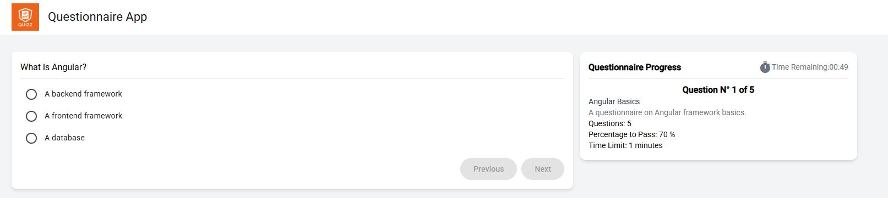
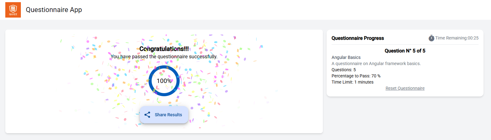

# Developer Documentation

## Questions App

### Overview

The **Questions App** is an Angular-based application designed to complete questionnaires. It features a countdown timer, progress tracking, and result evaluation.

### Preview




---

### Project Structure

The project follows a modular structure for scalability and maintainability:

```
.editorconfig
.gitignore
angular.json
package.json
README.md
tailwind.config.js
tsconfig.app.json
tsconfig.json
tsconfig.spec.json
src/
  index.html
  main.ts
  styles.css
  app/
    app.component.ts
    app.component.html
    app.component.css
    features/
      questionnaire/
        components/
        services/
    shared/
      data/
      enums/
      interfaces/
```

---

### Key Features

- **Dynamic Questionnaires**: Supports single-choice and multiple-choice questions.
- **Countdown Timer**: Automatically submits the questionnaire when time runs out.
- **Progress Tracking**: Displays the current question and progress.
- **Result Evaluation**: Shows the user's score and pass/fail status.

---

### Setup Instructions

#### Prerequisites

- Node.js (v16 or higher)
- Angular CLI (v19.1.2 or higher)

#### Installation

1. Clone the repository:

   ```bash
   git clone <repository-url>
   cd questions
   ```

2. Install dependencies:
   ```bash
   npm install
   ```

---

### Development

#### Start the Development Server

Run the following command to start the development server:

```bash
ng serve
```

Access the app at `http://localhost:4200/`.

#### Build the Project

To build the project for production:

```bash
ng build
```

The build artifacts will be stored in the `dist/` directory.

#### Run Unit Tests

Execute unit tests using Karma:

```bash
ng test
```

---

### Code Highlights

#### Countdown Timer

The countdown timer is implemented in the `QuestionnaireCountDownComponent` located in `src/app/features/questionnaire/components/countdown/countdown.component.ts`. It uses the `ngx-countdown` library and integrates with the `QuestionnaireCountdownService` to manage countdown states.

#### Questionnaire Form

The questionnaire form is managed by the `QuestionnaireFormComponent` located in `src/app/features/questionnaire/components/questionnaire-form/questionnaire-form.component.ts`. It dynamically generates form controls based on the question type and validates user input.

---

Enjoy using the Questions App!
